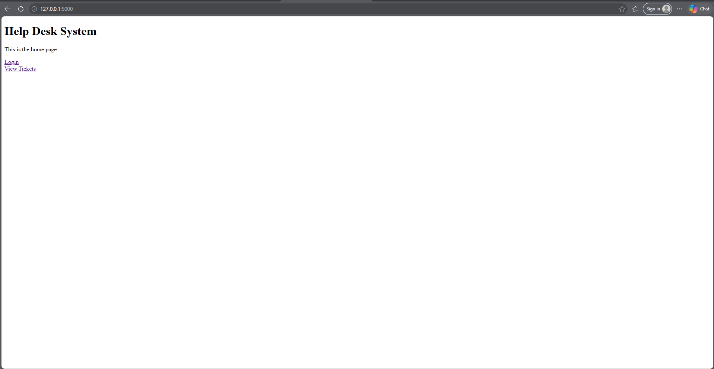
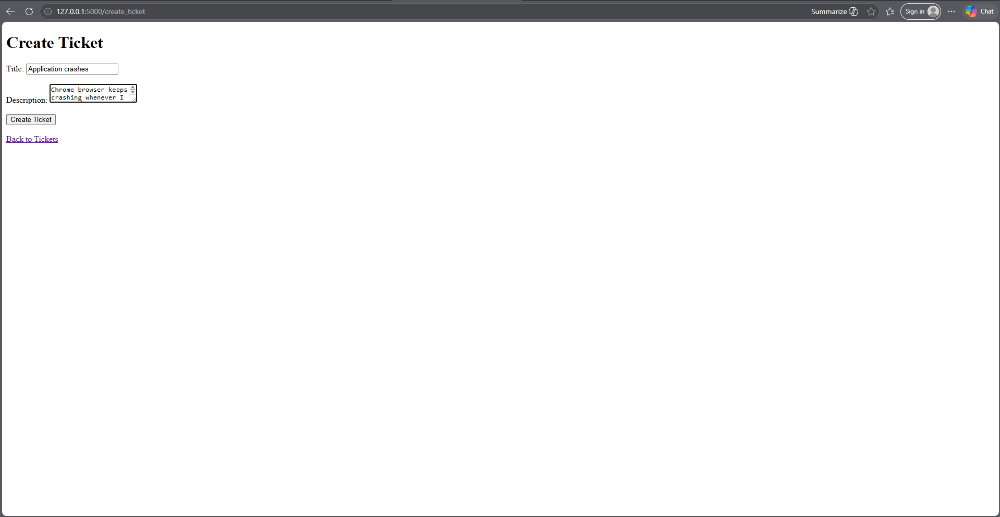
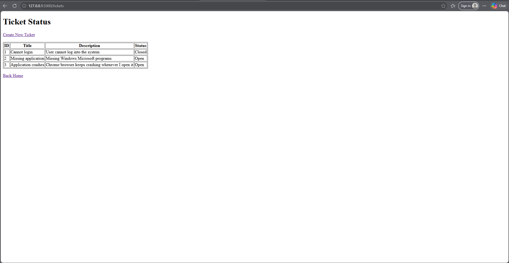
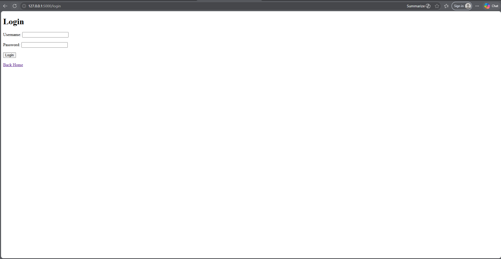
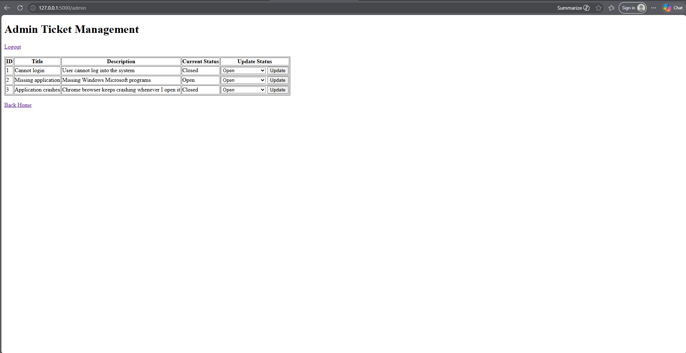
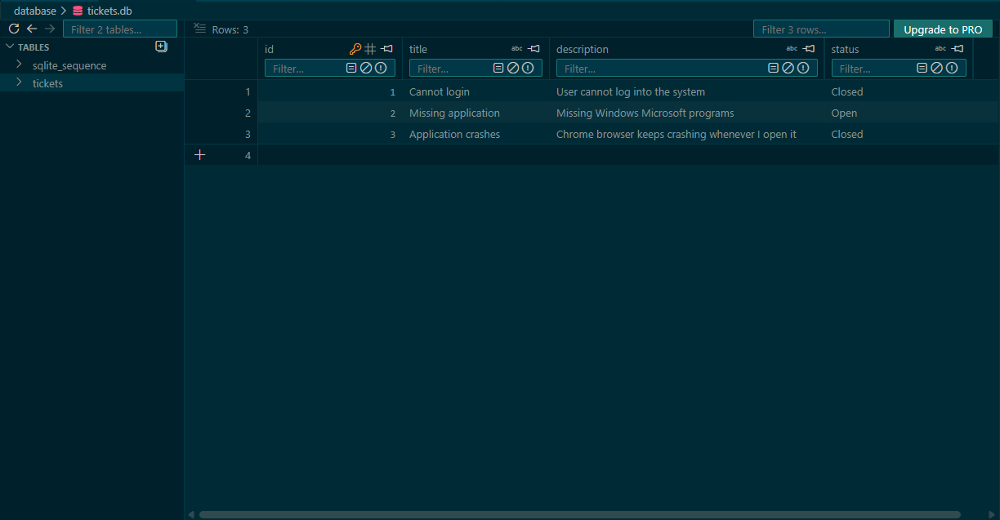
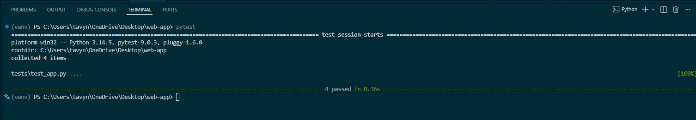
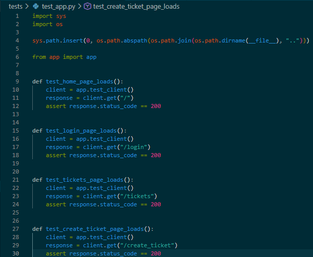

### Home Page

Landing page for users.

### Create Ticket Page

Users submit ticket information.

### Ticket Successfully Created

Ticket stored in SQLite database and displayed in the application.

### Administrator Login

Authentication page used for ticket management.

### Admin Dashboard

Allows administrators to update ticket status.

### Status Update

Status changed from Open to Closed.

### Pytest Results

Automated route validation using Pytest.

